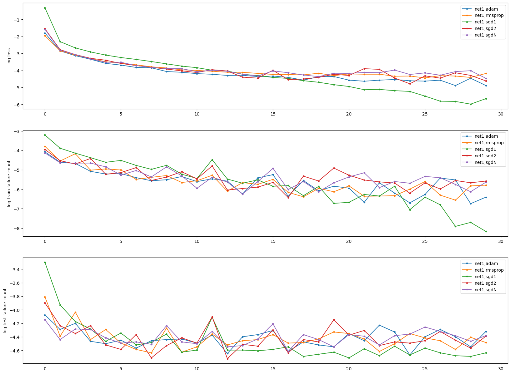

# About

Training neural network on MNIST dataset with pytorch

# Results

## Optimizers

Comparison of different optimizer convergence rate:


```
OPTIMIZER  : DURATION
net1,adam  : 230.4
net1,rmsprop : 197.0
net1,sgd1  : 155.5
net1,sgd2  : 166.6
net1,sgdN  : 166.6
```